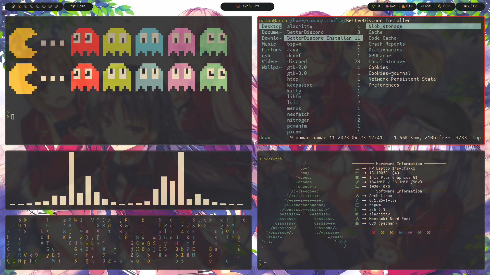
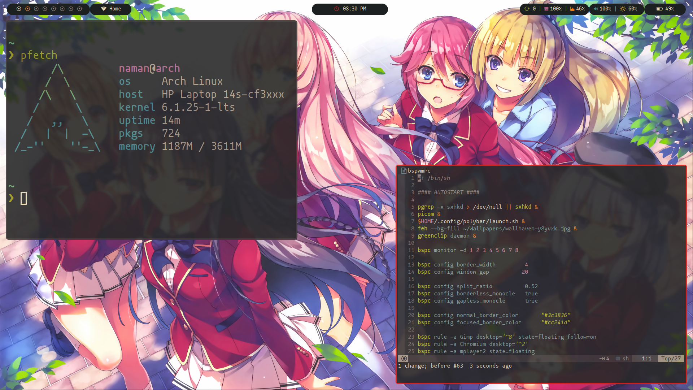

# Dotfiles


## Information

- OS: [Arch Linux](https://archlinux.org)
- WM: [bspwm](https://github.com/baskerville/bspwm)
- Colorscheme: [Gruvbox](https://github.com/morhetz/gruvbox)
- Terminal: [Alacritty](https://alacritty.org)
- Shell: [zsh](https://www.zsh.org)
- Text Editor: [Lunar vim](https://www.lunarvim.org)
- Compositor: [picom-ibhagwan](https://github.com/ibhagwan/picom)
- Application Launcher: [rofi](https://github.com/davatorium/rofi)
- Display Manager: [SDDM](https://github.com/sddm/sddm)
- Font: [Mononoki Nerd Font](https://github.com/ryanoasis/nerd-fonts)
- Bar: [Polybar](https://polybar.github.io)
- Browser: Firefox


## Screenshots






## Installation

Using install script

Clone this repository

```bash
git clone https://www.github.com/namanArora1022/dotfiles.git ~/.dotfiles
cd ~/.dotfiles
chmod +x install.sh
./install.sh
```

## License

[MIT LICENSED](https://github.com/namanArora1022/dotfiles/blob/master/LICENSE)


